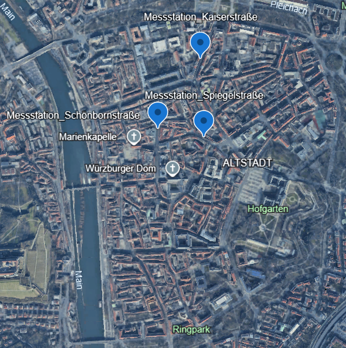

Libraries laden

```{r}
library(tidyverse)
library(readr)
library(broom)
library(gridExtra)
library(stats)
library(janitor)
library(skimr)
library(lubridate)
library(dplyr)
library(lubridate)
library(ggplot2)
library(fmsb)
```

```{r}
getwd()
```

# Passanten in Würzburg

## Import und Datenbereinigung

zuerst importiert man die Daten und zeigt Sie an um zu überprüfen ob der import funktioniert hat.

```{r}
passanten_raw <- read_csv2("Datensatz/passanten_wuerzburg.csv")
passanten <- as_tibble(passanten_raw)

passanten <- passanten %>%
  select(Zeitstempel,Wetter,Temperatur,Passanten,'Location Name',GeoPunkt) %>%
  mutate(
    Jahr = year(Zeitstempel),
    Monat = month(Zeitstempel),
    Woche = isoweek(Zeitstempel),
    Tag = day(Zeitstempel),
    Stunde = hour(Zeitstempel),
    Wochentag = weekdays(Zeitstempel),
    TagImJahr = yday(Zeitstempel)
  ) %>%
  filter(Jahr != 2023)
```

Nun besitzt man die Daten als Dataframe. Um mit ihnen sinvolle, descriptive oder weiterführend eine Explorative Datenanalyse durchzuführen sollten die Daten zuerst bereinigt werden. Als nächstes prüfen wir ob die Spalentnamen Aussagekräfig sind und ändern sie ab falls notwendig

```{r}
#Formatieren Spalten Namen
passanten <- clean_names(passanten)
```

Somit können wir nun leer Spalten entfernen und nachsehen wie vollständig die Daten sind.

```{r}
#Aufzählung der NA nach Spalte
colSums(is.na(passanten))

nrow(passanten)
#Entfernen leere Spalten
passanten <- janitor::remove_empty(passanten)
nrow(passanten)
```

Zum Schluss erhalten wir eine übersicht über die Daten

```{r}
summary(passanten)
skimr::skim(passanten)
```

## Aufgabe 1

## Beschreibung der Daten

Der Datensatz besteht aus 26018 Zeile und 14 Spalten.Die in den Spalten aufgezeichneten werte sind:

```{r}
head(passanten)
```

Die interessantest Variable ist hierbei die anzahl der Passanten. Dabei werden hir die anzahl der Passanten mit jewails eine Zeitstempel und weiteren Metadaten wie: Temperatur, Ort der Aufzeichnung und Koordinaten des Ortes Zeilenweise angegeben. Die Zeitstempel sind dabei Stündlich für jede der drei Messtationen angegeben.

```{r}
table(passanten$location_name)
```

Somit kann man davon ausgehen das die anzahl der Passanten der anzahl der Passanten entspricht die inerhalb einer Stunde durch die Messtation erfasst wurden. Die Metadaten dienen dann zur Interpretation der Hauptdaten.

### Erhebung

Die Daten stamen von zählstationen an verschiedenen Punken aus der Nürnberger Innenstadt. Mit hilfe von Laserschranken zählen diese die Anzahl der Passanten welche gerade die Messtation Queren. Durch das Messen mit meheren Laserschranken pro Messtation kann auch die Geh-Richtung des Passanten bestimmt werden. Zur konsistenz der Daten wird vermerkt: "Nach Herstellerangabe kann mit der verwendeten Technik bis zu einem Durchfluss von ca. 500 Personen pro Minute eine Zählgenauigkeit von 99% erreicht werden." vgl. Methodik_hystreet.com. Dabei ist zu beachten, dass eine Zählstation eine Straße bis Maximal 32m Breite abdecken kann. Die Erheber der daten versichern jedoch, dass "Bei den veröffentlichten Daten handelt es sich immer um die Passantenfrequenz der gesamten Straßenbreite (außer es ist explizit anders angegeben)."

### Standorte

```{r}
table(passanten$geo_punkt)
table(passanten$location_name)
```

Der Datenstatz enthält Koordinaten in der Spalte geo_punkt und die orte der Messtationen in der Spalte location_name. Wenn man sich anschaut wie of eine einzelner Standort vorkommt sieht man, dass es jewail 3 Einzelne Standorte gibt und dazu passend die 3 Standorte in Koordinatenform. Die Summen (Wie oft ein Einzelner eintrag vorkommt) ist ebenfalls gleich. Somit ist eine eindeutige zuordung der Standorte zu den Koordinaten möglich. Gleichzeit können wir sicher sein das keine Falschen Standorte oder Koordinaten vorliegen und das jeder Standort auch mit den Korrekten Korrdinaten versehen sind.Wenn man nun die Koordinaten auf einer Karte anzeigen Lässt erhält man folgendes Bild.


````{r}

````


```{r bild-einfuegen, echo=FALSE, out.width="50%", fig.cap="Hier steht die Bildunterschrift."}
# echo=FALSE versteckt den R-Code im finalen Dokument
# out.width="50%" setzt die Breite
# fig.cap="..." fügt eine Unterschrift hinzu


```

Man kann sehen, das die Stationen direkt in der Innenstad stationiert sind. Dabei ist jede Station in der Nähe einer Sehenswürdigkeit bzw. Öffentlichen Gebäude. Die Messtation Schönbornstraße befindet sich nah an der Marienkapelle, die Messtation Spiegelstraße auf dem weg zum Hofgarten und die Messtation Kaiserstraße in der nähe zum Hauptbahnhof. Dabei sind alle diese Straßen Hauptverkehrsstraßen auf welchen man mit gleichmäsiger auslastung rechnen kann. Das Dreiecksmuster welche die Stationen Aufspannen bilden somit eine Art Transitstrecke zwischen: Hauptbahnhof -\> Hofgarten -\> Marienkapelle -\> Hauptbahnhof.

## Aufgabe 2

```{r}
# --- 1. Analyse gegliedert nach Messstellen ---
# (Wie in deinem Code-Ansatz begonnen)

# Wir gruppieren nach dem Standortnamen
aggregiert_jahressume_pro_location <- passanten %>%
  group_by(location_name) %>%
  summarise(
    
    # 1. Jahressumme pro Standort
    passanten_jahr_summe = sum(passanten, na.rm = TRUE),
    
    anzahl_tage_erfasst = n_distinct(as.Date(zeitstempel)),
    
    # 2. Mittelwert pro Monat
    durchschnitt_pro_monat = passanten_jahr_summe / 12,
    
    # 3. Mittelwert pro Woche
    durchschnitt_pro_woche = passanten_jahr_summe / (anzahl_tage_erfasst / 7),

    # 4. Mittelwert pro Tag
    durchschnitt_pro_tag = passanten_jahr_summe / anzahl_tage_erfasst,
    
    # 5. Mittelwert pro Stunde
    durchschnitt_pro_stunde = mean(passanten, na.rm = TRUE)
  )

# --- 2. Analyse aggregiert (insgesamt) ---
passanten_insgesamt <- passanten %>%
  summarise(
    
    # 1. Jahressumme (Gesamt)
    passanten_jahr_summe = sum(passanten, na.rm = TRUE),
    
    # Hilfsberechnung: Anzahl der einzigartigen Tage im gesamten Datensatz
    anzahl_tage_erfasst = n_distinct(as.Date(zeitstempel)),

    # 2. Mittelwert pro Monat (Gesamt)
    durchschnitt_pro_monat = passanten_jahr_summe / 12,
    
    # 3. Mittelwert pro Woche (Gesamt)
    durchschnitt_pro_woche = passanten_jahr_summe / (anzahl_tage_erfasst / 7),
    
    # 4. Mittelwert pro Tag (Gesamt)
    durchschnitt_pro_tag = passanten_jahr_summe / anzahl_tage_erfasst,
    
    # 5. Mittelwert pro Stunde (Gesamt)
    durchschnitt_pro_stunde = mean(passanten, na.rm = TRUE)
  )

aggregiert_jahressume_pro_location
passanten_insgesamt
```

## Aufgabe 3

```{r}
mittelwert_monat <- passanten %>%
   group_by(location_name, monat) %>%
   summarise(monatssumme = sum(passanten)) %>%
   ungroup() %>%
   #Vertauschen der Zeilen und Spalten
   pivot_wider(names_from = location_name,
               values_from = monatssumme)%>%
   mutate(gesamtsumme = rowSums(across(where(is.numeric)), na.rm = TRUE)) %>%
   arrange(monat)
mittelwert_monat

mittelwert_monat_plot <- mittelwert_monat %>% 
   pivot_longer(cols = -monat,
                names_to = "location_name",
                values_to = "gesamtsumme")

mittelwert_monat_plot
```

```{r}
ggplot(data = mittelwert_monat_plot, aes(x = monat, y = gesamtsumme, color = location_name)) +
  geom_line(linewidth = 1) +  # Zeichnet die Linien
  geom_point() +              # Fügt die Datenpunkte hinzu

  # Stellt sicher, dass die x-Achse die Monate 1, 2, 3... anzeigt
  scale_x_continuous(breaks = 1:12,
   labels = c("Jan", "Feb", "Mar", "Apr", "Mai", "Jun", "Jul", "Aug", "Sep", "Okt", "Nov", "Dez" ))+

  # Titel und Achsenbeschriftungen
  labs(title = "Summen pro Monat und Straße",
       x = "Monat",
       y = "Summe",
       color = "Standort")
```

## Aufgabe 4
Passantenzahl
Als durschnittlicher Tageswert
nach Wochentag anzeigen

````{r}
durchschnittlicher_tageswert <- passanten %>% 
   group_by(wochentag, location_name)%>%
   summarise(
      durchschnitt = mean(passanten)
   )%>%
   ungroup()%>%
   mutate(
    wochentag = factor(wochentag, levels = c("Montag", 
                                            "Dienstag", 
                                            "Mittwoch", 
                                            "Donnerstag", 
                                            "Freitag", 
                                            "Samstag", 
                                            "Sonntag"))
  )
   
spider_plot_data <- durchschnittlicher_tageswert %>%
   pivot_wider(
      names_from = wochentag,
      values_from = durchschnitt
   )%>%
   select(-location_name)%>%
   as.data.frame()

df_weite <- ncol(spider_plot_data)
df_weite
min <- min(durchschnittlicher_tageswert$durchschnitt)
max <- max(durchschnittlicher_tageswert$durchschnitt)
#rbind bindet alle werte die man übergibt als neue Zeile auf einen neune df
spider_plot_data <- rbind(rep(max, df_weite), rep(min, df_weite), spider_plot_data)
spider_plot_data
````

````{r}
radarchart(spider_plot_data,
           title = "Durchschnittlicher Tageswert nach Wochentagen.",
           #Netz
           pcol= rgb(0.5,0,0.5),
           pfcol=rgb(0.2,0.5,0.5,0.5),
           plty = 1,
           
           #Grid
           cglty = 1
           )
````

# Literatur

<https://studyflix.de/statistik/mittelwert-6133>
